最近在工作室课上在讲 .NET 程序开发应该掌握的各种设计模式，恰巧看到设计模式中的原型模式与 JavaScript 中的继承机制——原型链有异曲同工之妙，便深入研究了一下。

在实际项目中，原型模式很少单独出现，一般是和工厂方法模式一起出现，通过 clone 的方法创建一个对象，然后由工厂方法提供给调用者。

现将本人学习心得分享与此以方便大家更好地学习掌握原型模式。

<!-- more -->

# 问题引入

当运行以下代码时，会产生什么样的结果呢？

``` cs
int a = 10;
int b = a;
b = 20;
Console.WriteLine(a);
```

答案是：

```
10
```

再运行以下代码时，又会产生什么样的结果呢？

``` cs
Person a = new Person("Jack",20);
Person b = a;
b.SetInfo("John",21);
a.Display();    // a显示的信息是什么？
```

答案是：

```
John 21
```

以上两段代码结构相似，但为何会产生不同的结果呢？

# 为什么

要明白这个问题，我们先得对 C# 的数据类型有一定的了解。

C# 的数据项类型一共分为以下几种：

* 值类型（Value types）
* 引用类型（Reference types）
* 指针类型（Pointer types）(此处不做讨论)

而 string 类型是一种具有值类型特性的特殊引用类型,并不是基本数据类型（底下有关于 string 的详细介绍）。值类型和引用类型的区别看下表：

|                  |            值类型            |                 引用类型 |
| ---------------- | :--------------------------: | -----------------------: |
| 内存分配地点     |          分配在栈中          |               分配在堆中 |
| 效率             |    效率高，不需要地址转换    | 效率低，需要进行地址转换 |
| 内存回收         |      使用完后，立即回收      |             垃圾回收机制 |
| 赋值操作         | 进行复制，创建一个同值新对象 |     只是对原有对象的引用 |
| 函数参数和返回值 |         是对象的复制         |         是原有对象的引用 |

通过以下图片我们可以看到对象的值的传递情况

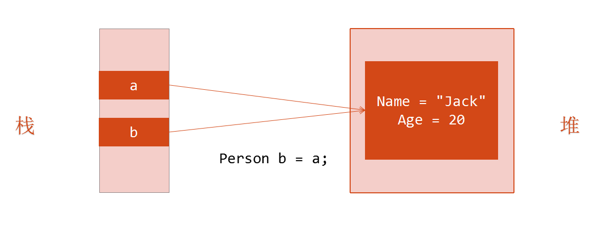

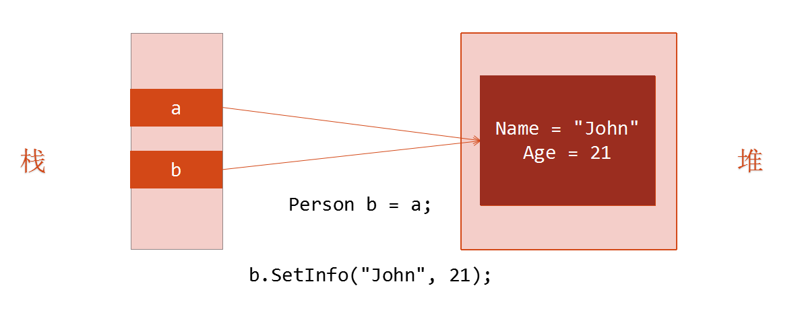

Person b = a 后，即将 a 的值赋值给了 b ，此时 a 和 b 都同时指向同一个堆里，b.SetInfo("John",21) 即改变了堆里的值，而 a 的值仍然是从堆里获取，所以 a.Display() 的值为 John 21。

但如何实现如下面两张图一样的数据传递呢？

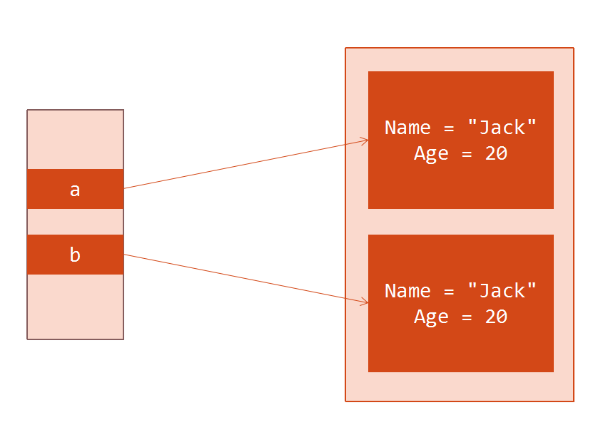

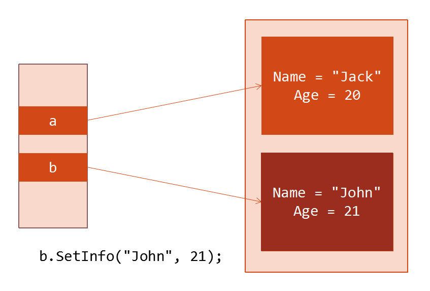

原型模式告诉你答案！！！

# 原型模式

## 原型模式介绍

维基百科：原型模式（Prototype Pattern）是创建型模式的一种，其特点在于通过「复制」一个已经存在的实例来返回新的实例，而不是新建实例。被复制的实例就是我们所称的「原型」（Prototype），这个原型是可定制的。

## 原型模式的UML类图

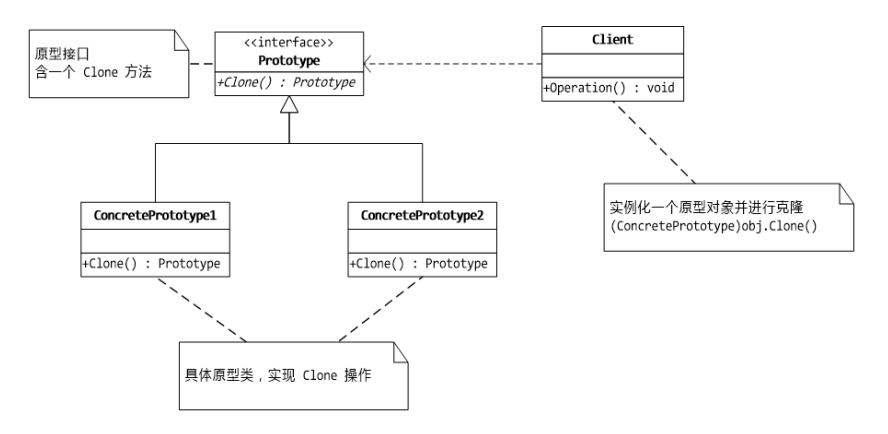

## 原型模式的简单实现

申明抽象原型类和具体原型类：

``` cs
// 抽象原型类:声明克隆自身的接口
public interface Prototype
{
    Prototype Clone();
}

// 具体原型类:实现克隆的具体操作
public class ConcretePrototype1 : Prototype
{
    public Prototype Clone()
    {
        Console.WriteLine("ConcretePrototype1 Cloned!");
        return (Prototype)this.MemberwiseClone();
    }
}

public class ConcretePrototype2 : Prototype
{
    public Prototype Clone()
    {
        Console.WriteLine("ConcretePrototype2 Cloned!");
        return (Prototype)this.MemberwiseClone();
    }
}
```

主程序调用：

``` cs
// 客户类:让一个原型克隆自身，从而获得一个新的对象
public class Client
{
    static void Main(string[] args)
    {
        ConcretePrototype1 obj1 = new ConcretePrototype1();
        ConcretePrototype1 obj2 = new ConcretePrototype2();

        ConcretePrototype1 cloneObj1 = (ConcretePrototype1)obj1.Clone();
        ConcretePrototype1 cloneObj2 = (ConcretePrototype2)obj2.Clone();
    }
}
```

程序运行结果：

```
ConcretePrototype1 Cloned!
ConcretePrototype2 Cloned!
```

## 简历的原型实现

简历类：

``` cs
// 简历
class Resume : ICloneable
{
    private string name;
    private string sex;
    private string age;
    private string timeArea;
    private string company;

    public Resume(string name)
    {
        this.name = name;
    }

    // 设置个人信息
    public void SetPersonalInfo(string sex, string age)
    {
        this.sex = sex;
        this.age = age;
    }

    // 设置工作经历
    public void SetWorkExperience(string timeArea, string company)
    {
        this.timeArea = timeArea;
        this.company = company;
    }

    // 显示
    public void Display()
    {
        Console.WriteLine("{0} {1} {2}", name, sex, age);
        Console.WriteLine("工作经历：{0} {1}", timeArea, company);
    }

    public Object Clone()
    {
        return (Object)this.MemberwiseClone();
    }
}
```

客户端调用代码：

``` cs
static void Main(string[] args)
{
    Resume a = new Resume("大鸟")；
    a.SetPersonalInfo("男", "29");  
    a.SetWorkExperience("1998-2000", "XX公司")  
  
    Resume b = （Resume）a.Clone();  
    b.setWorkExperience("1998-2006", "YY企业")  
  
    Resume c = （Resume）a.Clone();  
    c.SetPersonalInfo("男", "24");  
  
    a.Display();
    b.Display();  
    c.Display();  

    Console.Read();
}
```

结果显示：

```
大鸟 男 29
工作经历  1998-2000  XX公司
大鸟 男 29
工作经历  1998-2006  YY公司
大鸟 男 24
工作经历  1998-2000  XX公司
```

## 实现ICloneable接口

.NET 在 System 命名空间中提供了 ICloneable 接口，其中只包含一个 Clone() 方法，实现了这个接口就是完成了原型模式。

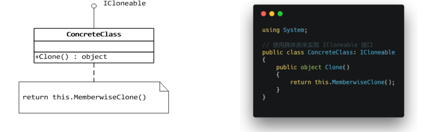

# 浅拷贝与深拷贝

注：string 是一种拥有值类型特点的特殊引用类型！（例：上面简历的原型实现代码）

* string 不是基本数据类型，而是一个类（class）
* class string 继承自对象 （object） ，而不是 System.ValueType ( Int32 这样的则是继承于 System.ValueType) 
* string 本质上是个 char[]，而 Array 是引用类型，并且初始化时也是在托管堆分配内存的，但是这个特殊的类却表现出值类型的特点，微软设计这个类的时候为了方便操作，所以重写了 == 和 != 操作符以及 Equals 方法，它判断相等性时，是按照内容来判断的，而不是地址
* string 在栈上保持引用，在堆上保持数据

## 浅拷贝（Shallow Copy）

* 只复制对象的值类型字段，引用类型只复制引用不复制引用的对象（即复制地址）
* MemberwiseClone() 方法是浅拷贝（[微软关于 MemberwiseClone() 的介绍](https://docs.microsoft.com/zh-cn/dotnet/api/system.object.memberwiseclone?view=netframework-4.7.1#System_Object_MemberwiseClone)）

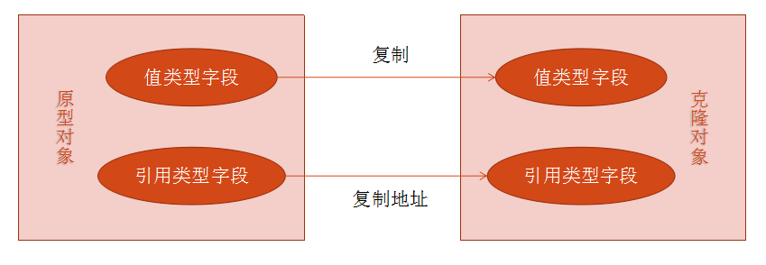

### 浅拷贝引用类型会出现的错误

工作经历类

``` cs
Class WorkExperience  
{  
    private string workDate;  
    public string WorkDate  
    {  
        get { return workDate; }  
        set { workDate = value; }  
    }  
    private string company;  
    public string Company  
    {  
        get { return company; }  
        set { company = value; }  
    }  
}
```

简历类

``` cs
// 简历
class Resume:ICloneable  
{  
    private string name;  
    private string sex;  
    private string age;  

    private WorkExperience work;    // 引用"工作经历"对象  
    public Resume(string name)  
    {  
        this.name = name;  
        work = new WorkExperience();    // 在“简历”类实例化时同时实例化“工作经历”  
    }  
  
    // 设置个人信息：  
  
    public void SetPersonalInfo(string sex,string age)
    {  
        this.sex = sex;  
        this.age = age;  
    }  
    // 设置工作经历  
  
    public void SetWorkExperience（string workDate，string company)  
    {  
        work.WorkDate = workDate;  
        work.Company = company;    // 调用此方法时，给对象的两属性赋值
    }  
  
    // 显示  
  
    public void Display()  
    {  
        Console.WriteLine("{0} {1} {2}", name, sex, age);  
        Console.WriteLine("工作经历: {0} {1}", work.WorkDate, work.Company;  
    }  
  
    public Object Clone()  
    {  
        return (Object)this.MemberwiseClone();  
    }
}
```

客户端调用代码

``` cs
static void Main（string[] args）  
{  
    Resume a = new Resume("大鸟");  
    a.SetPersonalInfo("男", "29");  
    a.SetWorkExperience("1998-2000", "XX公司")  
  
    Resume b = （Resume）a.Clone();  
    b.setWorkExperience("1998-2006", "YY企业")  
  
    Resume c = （Resume）a.Clone();  
    c.SetPersonalInfo("男","24");  
    c.SetWorkExperience("1998-2003", "ZZ企业");  
  
    a.Display();
    b.Display();  
    c.Display();  

    Console.Read();  
}
```

结果显示

```
大鸟 男 29
工作经历  1998-2003  ZZ公司
大鸟 男 29
工作经历  1998-2003  ZZ公司
大鸟 男 24
工作经历  1998-2003  ZZ公司
```

从结果显示我们可以看到，由于浅复制是浅表复制，所以对于值类型，没什么问题（如 c.Display()）；对于引用类型，只是复制了引用，引用的对象还是指向原来的对象，所以给 a, b, c 三个引用设置‘工作经历’，却同时看到三个引用都是最后一次设置，因为三个引用都指向了同一个对象。

## 深拷贝（Deep Copy）

* 不仅复制值类型字段，而且复制引用的对象
* 把引用对象的变量指向复制过的新对象，而不是原有的被引用对象

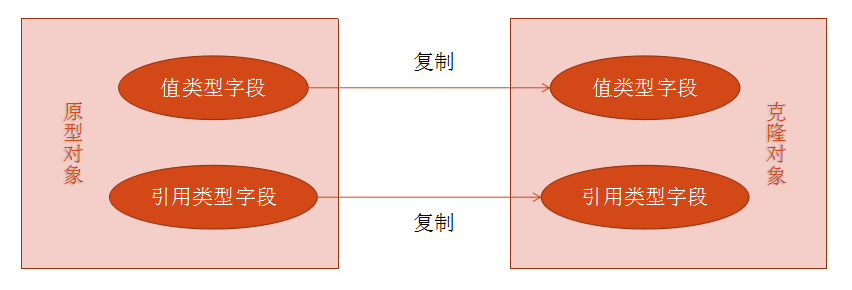

### 实现深拷贝

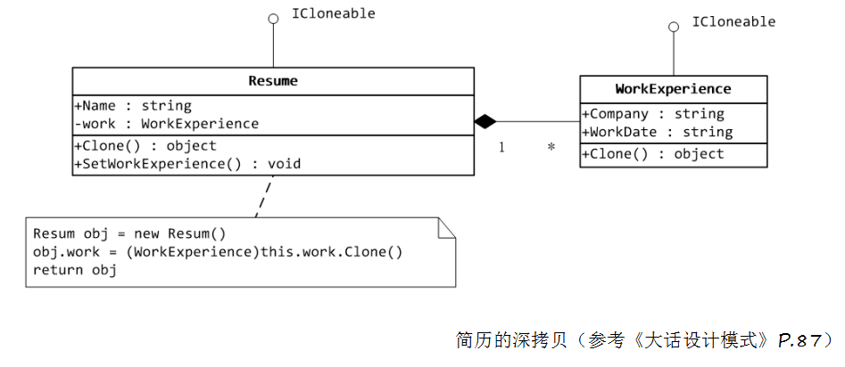

简历和工作经历类：

``` cs
// 简历
public class Resume : ICloneable
{
    public string Name { get; set; }
    private WorkExperience work;

    public void SetWorkExperience(string workDate, string company)
    {
        work.WorkDate = workDate;
        work.Company = company;
    }

    public void Display()
    {
        Console.WriteLine(
            $"{ Name } Worded in { work.Company } from { work.WorkDate }.");
    }

    public Resume(string name)
    {
        Name = name;
        work = new WorkExperience();
    }

    // 调用私有的构造方法，让“工作经历”克隆完成，最终返回一个深复制的简历对象
    public object Clone()
    {
        Resume cloned = new Resume(this.Name);
        cloned.work = (WorkExperience)this.work.Clone();  // 克隆工作经历
        return cloned;
    }
}

// 工作经历
public class WorkExperience : ICloneable    // 让“工作经历”实现 ICloneable 接口
{
    public String WorkDate { get; set; }
    public String Company { get; set; }

    public object Clone()    // 让“工作经历”类实现克隆方法
    {
        return this.MemberwiseClone();
    }
}
```

主程序调用：

``` cs
public class Program
{
    static void Main(string[] args)
    {
        Resume resume = new Resume("Jack");
        resume.SetWorkExperience("2012-2015", "XX公司");

        Resume cloned = (Resume)resume.Clone();
        cloned.SetWorkExperience("2015-2018", "YY公司");

        resume.Display();
        cloned.Display();
    }
}
```

程序运行结果：

```
Jack worked in XX公司 from 2012-2015
Jack worked in YY公司 from 2015-2018
```

# 原型模式的应用

## JavaScript 继承机制——原型链

参考文章：[阮一峰《Javascript 继承机制的设计思想》](http://www.ruanyifeng.com/blog/2011/06/designing_ideas_of_inheritance_mechanism_in_javascript.html)

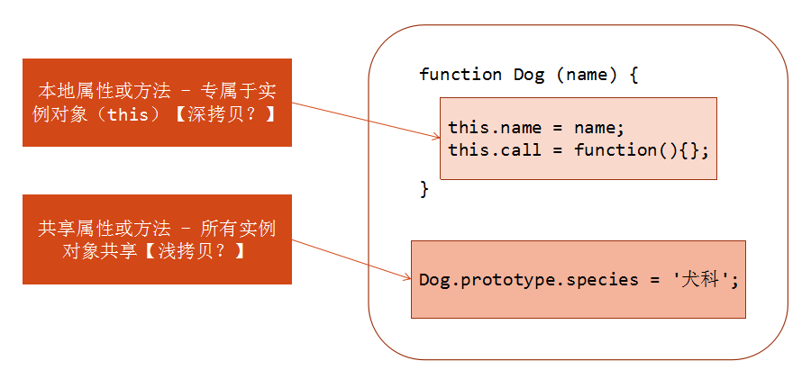

JavaScript 的创始人 Brendan Eich 在开发 JavaScript 这个使得浏览器可以与网页互动的脚本易语言时，正是面向对象编程（object-oriented programming）最兴盛的时期，C++ 是当时最流行的语言，而 Java 语言的1.0版即将于第二年推出，Sun公司正在大肆造势。

Brendan Eich 无疑受到了影响，Javascript 里面所有的数据类型都是对象（object），这一点与 Java 非常相似。但是，他随即就遇到了一个难题，到底要不要设计"继承"机制呢？如果真的是一种简易的脚本语言，其实不需要有"继承"机制。但是，Javascript 里面都是对象，必须有一种机制，将所有对象联系起来。所以，Brendan Eich 最后还是设计了"继承"。但是，他不打算引入"类"（class）的概念，因为一旦有了"类"，Javascript 就是一种完整的面向对象编程语言了，这好像有点太正式了，而且增加了初学者的入门难度。他考虑到，C++ 和 Java 语言都使用 new 命令，生成实例。因此，他就把new命令引入了 Javascript，用来从原型对象生成一个实例对象。但是，Javascript 没有"类"，怎么来表示原型对象呢？

这时，他想到 C++ 和 Java 使用 new 命令时，都会调用"类"的构造函数（constructor）。他就做了一个简化的设计，在 Javascript 语言中，new 命令后面跟的不是类，而是构造函数。

举例来说，现在有一个叫做 DOG 的构造函数，表示狗对象的原型。

``` js
function DOG(name){
    this.name = name;
}
```

对这个构造函数使用 new，就会生成一个 DOG 对象的实例。

``` js
var dogA = new DOG('大毛');
alert(dogA.name);   // 大毛
```

注意构造函数中的 this 关键字，它就代表了新创建的实例对象。

但是用构造函数生成实例对象，有一个缺点，那就是无法共享属性和方法。比如，在 DOG 对象的构造函数中，设置一个实例对象的共有属性 species。然后，生成两个实例对象：

``` js
function DOG(name){
　　this.name = name;
　　this.species = '犬科';
}

var dogA = new DOG('大毛');
var dogB = new DOG('二毛');
```

这两个对象的 species 属性是独立的，修改其中一个，不会影响到另一个。

``` js
dogA.species = '猫科';
alert(dogB.species);   // 显示"犬科"，不受dogA的影响
```

考虑到这一点，Brendan Eich 决定为构造函数设置一个 prototype 属性。

这个属性包含一个对象（以下简称"prototype 对象"），所有实例对象需要共享的属性和方法，都放在这个对象里面；那些不需要共享的属性和方法，就放在构造函数里面。

实例对象一旦创建，将自动引用 prototype 对象的属性和方法。也就是说，实例对象的属性和方法，分成两种，一种是本地的，另一种是引用的。

还是以 DOG 构造函数为例，现在用 prototype 属性进行改写：

``` js
function DOG(name){
　　this.name = name;
}

DOG.prototype = { species : '犬科' };

var dogA = new DOG('大毛');
var dogB = new DOG('二毛');

alert(dogA.species);   // 犬科
alert(dogB.species);   // 犬科
```

现在，species 属性放在 prototype 对象里，是两个实例对象共享的。只要修改了 prototype 对象，就会同时影响到两个实例对象。

``` js
DOG.prototype.species = '猫科';

alert(dogA.species);   // 猫科
alert(dogB.species);   // 猫科
```

## 数据模型缓存

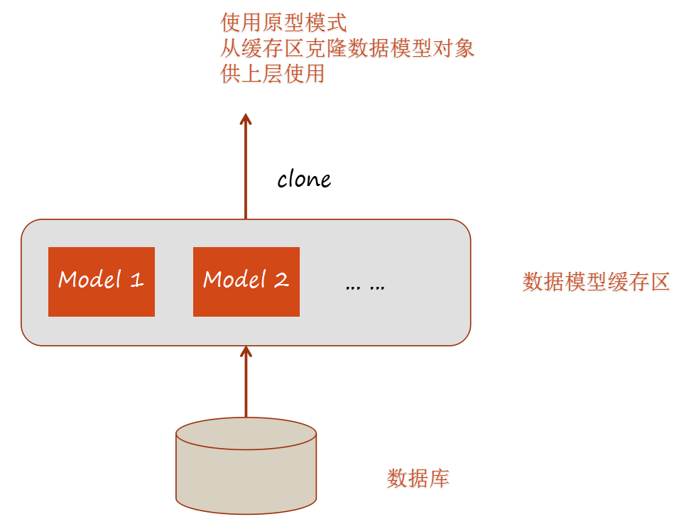

实现示例：创建一个抽象类 CloneableModel，并让类 User、Product 来扩展它；然后定义 ModelCache 类，该类把 CloneableModel 对象存储在 HashTable 中，并在请求的时候返回对应类型的克隆对象。

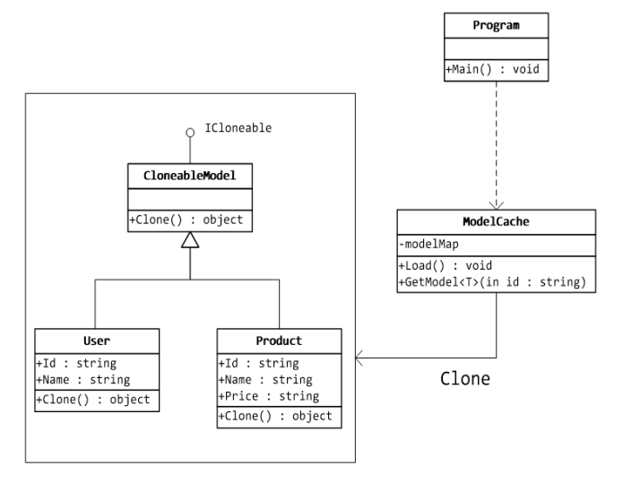

CloneableModel类定义及扩展：

``` cs
using System;

// 可克隆模型
// 实现 ICloneable 接口
public abstract class CloneableModel : ICloneable
{
    public object Clone()
    {
        return this.MemberWiseClone();
    }
}

// 用户
public class User : CloneableModel
{
    public string Id { get; set; }
    public string Name { get; set; }
}

// 商品
public class Product : CloneableModel
{
    public string Id { get; set; }
    public string Name { get; set; }
    public string Price { get; set; }
}
```

ModelICache类定义：

``` cs
using System;
using System.Collections;

public class ModelCache
{
    static Hashtable modelMap = new Hashtable();

    // 将模型类对象存储到 Hashtable 中
    // 实际开发中，模型对象从数据库中取出
    public static void Load()
    {
        User user = new User { 
            Id = "#1001", 
            Name = "John Doe" 
        };
        modelMap.Add(user.Id, user);

        Product product = new Product { 
            Id = "#2001", 
            Name = "Illustrated C# 2012", 
            Price = "￥89.00" 
        };
        modelMap.Add(product.Id, product);

        Console.WriteLine("Db Models Cache loading ... Down!");
    }

    public static T GetModel<T>(string id) where T : class, new()
    {
        CloneableModel cache = (CloneableModel)modelMap[id];

        return cache != null
            ? (T)cache.Clone()    // 从 cache 中克隆 model
            : null;
    }
}
```

主程序调用：

``` cs
class Program
{
    static void Main(string[] args)
    {
        ModelCache.Load();

        User userCloned = ModelCache.GetModel<User>("#1001");
        Product productCloned = ModelCache.GetModel<Product>("#2001");

        if (userCloned == null || productCloned == null)
            return;

        Console.WriteLine(
            $"ID: { userCloned.Id } Name: { userCloned.Name }");

        Console.WriteLine(
            $"ID: { productCloned.Id } Name: { productCloned.Name } Price: { productCloned.Price }");
    }
}
```

程序运行结果：

``` c#
Db Models Cache Loading ... Down!
ID: #1001 Name: John Doe
ID: #2001 Name: Illustrated C# 2012 Price: ￥89.00
```

# 模式总结

## 优点

* 隐藏了对象的创建细节，对有些初始化需要占用很多资源的类来说，对性能也有很大提高。
* 在需要新对象时，可以使用Clone来快速创建创建一个，而不用使用new来构建。

## 缺点

* 每一个类都需要一个Clone方法，而且必须通盘考虑。对于深拷贝来说，每个关联到的类型都不许实现IClonable接口，并且每增加或修改一个字段是都需要更新Clone方法。

## 适用场景

* 资源优化场景：类初始化需要消化非常多的资源，这个资源包括数据、硬件资源等。
* 性能和安全要求的场景：通过new产生一个对象需要非常繁琐的数据准备或访问权限，则可以使用原型模式。
* 一个对象多个修改者的场景：一个对象需要提供给其他对象访问，而且各个调用者可能都需要修改其值时，可以考虑使用原型模式拷贝多个对象供调用者使用。