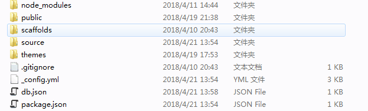
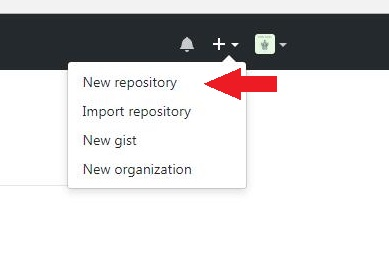
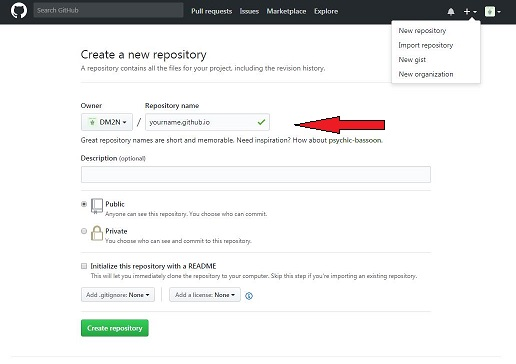
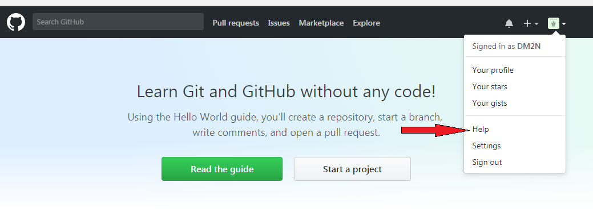
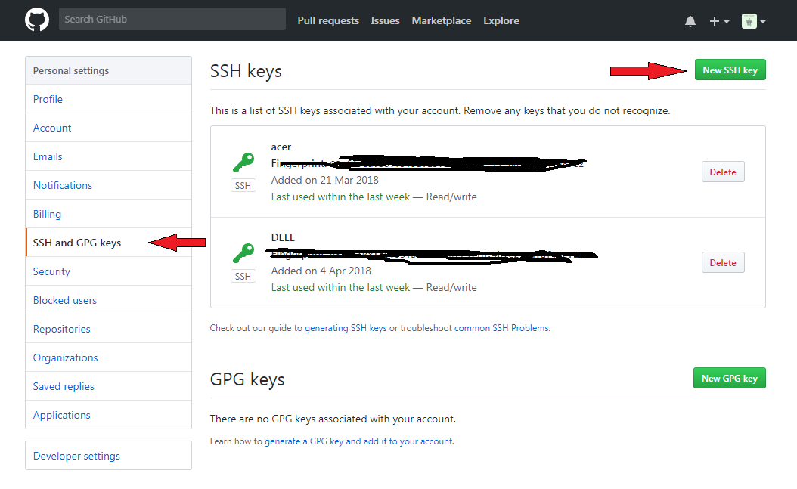
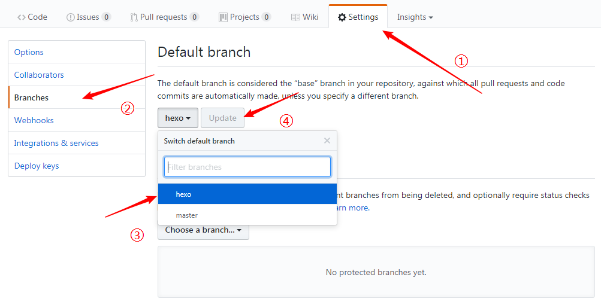

想搭建一个属于自己的博客网站，用来发布一些文章以及交流学习。发现利用hexo来搭建个人博客挺方便的，于是便自己试着搭建了一个。特写下此文，一防忘记，二供大家参考。

<!-- more -->

# 步骤

1. 安装Git
2. 安装NodeJs
3. 安装hexo
4. 生成SSH并添加到github
5. 部署项目
6. 上传到github
7. 绑定个人域名
8. 修改及配置主题
9. 添加RSS
10. 添加评论
11. 写博客文章
12. 站点管理文件

# 准备工作

## 安装Git

* Git:[下载地址](https://gitforwindows.org/)
* 参考文章:[《W3C school上Git教程之Git安装配置》](https://www.w3cschool.cn/git/git-install-setup.html)

## 安装NodeJs

Hexo是基于Node.js环境的静态博客，里面的npm工具很有用啊，所以还是老老实实把这玩意儿装了吧！

安装步骤：反正下载好msi文件后，双击打开安装，也是一路next，不过在Custom Setup这一步记得选 Add to PATH ,这样你就不用自己去配置电脑上环境变量了，装完在按 win + r 快捷键调出运行，然后输入cmd确定，在cmd中输入path可以看到你的node是否配置在里面（环境变量），没有的话你就自由发挥吧！

* NodeJs[下载地址](https://nodejs.org/en/)(说明：LTS为长期支持版，Current为当前最新版)
* 参考文章:[《W3C school上Node.js教程之Node.js安装配置》](https://www.w3cschool.cn/nodejs/nodejs-install-setup.html)

## 安装hexo

先创建一个文件夹（用来存放所有blog的东西），然后cd到该文件夹下。

安装hexo命令：（在新建的文件夹里右键Git Bash Here）

``` bash
$ npm i -g hexo
```

接着初始化命令：hexo init ：

``` bash
$ hexo init
```

初始化完成之后打开所在的文件夹可以看到以下文件：



解释一下：

* node_modules：是依赖包
* public：存放的是生成的页面
* scaffolds：命令生成文章等的模板
* source：用命令创建的各种文章
* themes：主题
* _config.yml：整个博客的配置
* db.json：source解析所得到的
* package.json：项目所需模块项目的配置信息

做好这些前置工作之后接下来的就是各种配置了。

# 配置工作

## 生成SSH并添加到github

没账号的先创建一个github账号，有账号的看下面。[注册传送门](https://github.com)

创建一个repo，名称为YourName.github.io, 其中YourName是你的github名称，按照这个规则创建才有用，如下：

<!--  -->


<!--  -->


回到git bash中，配置github账户信息（YourName和YourEmail都替换成你自己的）：

``` bash
$ git config global user.name "YourName"
```

``` bash
$ git config global user.email "YourEmail"
```

配置ssh，Git bash中输入命令：

``` bash
$ ssh-keygen -t rsa -C "youremail@example.com"
```

一路回车，就能在你的电脑中产生ssh，ssh文件默认在:C:User/Administrator/.ssh文件夹下，打开.ssh文件夹下的id_rsa.pub文件，将里面的内容复制；再打开github的setting：



将.ssh文件夹下的id_rsa.pub文件里一经复制好了的内容添加到ssh keys:



添加一个 New SSH key ，title随便取，key就填刚刚复制好了的那一段。

在Git bash中验证是否添加成功：

``` bash
$ ssh -T git@github.com
```

完成下一步你就成功了！

## 部署项目

用编辑器打开你的blog项目，修改_config.yml文件的一些配置：

``` bash
deploy:
    type: git
    repo: https://github.com/yourgithubname/yourgithubname.github.io.git
    branch: master
```

在Git bash中，依次输入以下命令：

``` bash
$ hexo clean
```

``` bash
$ hexo g
```

``` bash
$ hexo s
```

注：hexo 3.0把服务器独立成个别模块，需要单独安装：

``` bash
$ npm i hexo-server
```

打开浏览器输入：http://localhost:4000

你就可以看到你的项目在本地能够预览了。

## 部署到github上

先安装一波，这样才能将你写好的文章部署到github服务器上并让别人浏览到,输入命令：

``` bash
$ npm install hexo-deployer-git --save
```

再依次执行以下命令：

``` bash
$ hexo clean
```

``` bash
$ hexo g
```

``` bash
$ hexo d
```

注意deploy的过程中(即hexo d)可能要输入你的github上的userName及password

一切都ok之后，在浏览器中输入[http://yourgithubname.github.io](#)就可以看到你的个人博客，飞起来！！！

## 绑定个人域名

虽然，使用[http://yourgithubname.github.io](#)也可以让别人看到你写的博客。

但是，写博客写博客，还是要有点装逼的嘛。搭配一个属于自己的域名显然会让自己的博客变得高大上起来。

可以去各大域名销售平台买自己喜欢的域名。（不想绑定的可以跳过这一个环节直接看下一节）

第一步购买域名：随便在哪个网站买一个就行；

第二步添加CNAME：在项目的source文件夹下新建一个名为CNAME的文件，在里面添加你购买的域名：


其中ip地址为你的github的地址，可在cmd中ping一下就能看到(ping yourName.github.io)：


接着再次部署（hexo d）一下，用你购买的域名打开，就可以看到你的博客了了了了了！！！

## 修改及配置主题

hexo初始化之后默认的主题是landscape , 然后你可以去[这个地址](https://hexo.io/themes/)里面找到你想要的主题。在github中搜索你要的主题名称，里面都会有该主题的如何使用的介绍，按着来就好了。。

## 添加RSS

先安装rss相关插件，Git bash命令：

``` bash
$ npm i hexo-generator-feed
```

在你的项目的_config.yml配置文件下找到Extensions添加如下内容：

``` bash
# Extensions  #插件和主题
## Plugins: https://hexo.io/plugins/
## Themes: https://hexo.io/themes/
# RSS订阅
plugin:
- hexo-generator-feed
#Feed Atom
feed:
  type: atom
  path: atom.xml
  limit: 20
```

进入到你的主题的配置文件下，找到你的放rss的位置，添加/atom.xml即可。重新部署再打开就能看到效果了。

## 添加评论

评论功能为第三方评论系统，但，多说、网易云跟帖等都已关闭服务。来必力等也能用，所以，骚年，翻墙吧，具体做法，聪明的你肯定是知道百度的。

## 写博客文章

新建文章，输入命令：

``` bash
$ hexo new '文章名'
```

然后你就可以在source/_posts路径下看到你创建的文章，编辑完成之后按照前面说的方式部署，在浏览器刷新就能看到你的文章了。

博客文章采用markdown格式编写，至于markdown，骚年，学习吧！！！-->[前往教室](https://www.appinn.com/markdown/index.html)

## 站点管理文件

如果本地站点文件丢失了或换了电脑怎么办？为解决这个问题，我们利用了Github的多分支来管理站点文件：

1. 用master分支来管理发布的文件，即public文件夹下的文件；
2. 用hexo分支来管理主站点文件，即除public下和.gitignore忽视的其他文件；
3. 将hexo设为默认分支。

为此，我们要：

### 建立远程仓库

先将远程仓库关联到本地。进入站点文件夹，输入命令：

``` bash
$ git init
```

``` bash
$ git remote add origin git@github.com:username/username.github.io.git #使用站点仓库地址关联
```

``` bash
$ git pull
```

### 创建hexo分支

``` bash
$ git checkout -b hexo  #创建并切换到hexo分支

```

### 将hexo设为默认分支

在Github上的站点仓库上，点击Settings=>Branches，将Default branch切换成hexo，然后点击Update即可。



### 将主站点文件push到hexo分支

在hexo分支（使用git branch命令查看当前所在分支）下，输入命令：

``` bash
$ git add .
```

``` bash
$ git commit -m "提交记录"
```

``` bash
$ git push -u origin hexo  #初次push要加-u，此后可省
```

### 本地站点恢复

1. 使用git clone命令克隆站点仓库（默认分支为hexo）：

``` bash
$ git clone git@github.com:username/username.github.io.git
```

2. 在本地新拷贝的username.github.io文件夹下依次执行命令：

``` bash
$ npm install hexo-cli
```

``` bash
$ npm install
```

注意，此时不需要执行hexo init这条命令。

到此，便完成了对站点的一些简单管理。